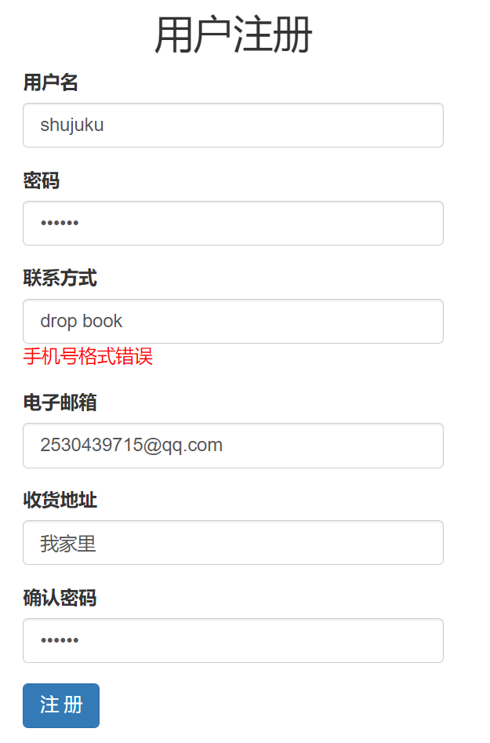

# <center>豆丝豆瓣</center>


<center>课程名称：数据库及实现</center>

<center>课程教师：郑卫国</center>

<center>学院：大数据学院</center>

<center>小组成员：刘威毅 姚博远 张冀</center>


# <center>目录</center>

[toc]


# 1. 需求分析

## 1.1 背景介绍

​	网上书店，是一种以网站作为载体的图书交易结构，提供一种高质量、更便捷的购买实体书的方式。近年来，受益于互联网、电商的发展，我国网上书店行业发展迅速，市场规模逐年扩大，并逐渐成为图书零售的主渠道。这一领域具有以下三个优点：

1. 检索能力强：传统书店与普通店铺相同，无法在柜台展现所有商品，读者去寻找想要的商品也十分麻烦。而网上书店有利于其网络平台，可以很方便的进行搜索、排列、对比，让读者可以很轻松地找到最适合的图书。
2. 客户范围广：网上书店不需要实体店面，其用户范围几乎是所有快递可以运达的位置。读者可以不被店铺大小、店铺地理位置等因素阻碍。
3. 增值服务：基于网络平台，网上书店可以提供更多样的增值服务。在读者读完一本书之后，自然而然有想分享看法的欲望。因此评论系统，交流系统可以是网上书店的特色。读者也可以通过其他人的评价来决定自己是否购买一本图书，因此一个评分系统也可以是一种增值服务。此外，书店也可以基于用户的历史记录，针对每个读者的爱好提供独特的推荐。

​	因此，作为大数据DataScience的我们，作为本课程期末项目，决定建立类似于豆瓣的平台，运用数据库知识建立完整的系统，并起名为DSDouban（豆丝豆瓣）。

## 1.2 用户需求

​	在实际项目中需求调研往往会用到各种调查方法以及统计方法，由于本课程侧重于数据库及实现，在需求调研方面我们从简：询问好友，关于网上书店的看法。


​	我们可以看到，用户需求与背景介绍中的网上商城的优势相差不远。我们可以将系统中的用户需求主要分为三大板块：

### 	1.2.1 信息浏览

​	用户如果要下单图书，那么用户必须可以查看该图书的详细信息，包括书名、作者、出版社、简介等内容。作者信息、译者信息等，也将是用户参考的重要资料。

​	而使用户能够找到自己想要的书籍，一个优秀的检索机制必不可少。用户应该可以通过一两个书籍的名字或作者等关键词，来查询到想要的书籍。

​	排序功能也可以大大提高用户浏览体验。按照评分排序、按照价格排序，可以使用户对于想要的书籍有更好的比对。

​	此外，对于书籍的分类也很重要。读者可能喜欢科幻但不知道有什么书籍适合自己，那么我们应该提供相应的分类机制。而分类机制也可以做成多级分类，有大分类，有细分类。这样用户能够更好地找到喜爱的书籍。

### 	1.2.2 书籍购买

​	网上商城最基本的就是书籍的购买。用户可以从我们的平台下单多本图书，并且经由快递送达到自己家中，这是最基本的需求。

​	而我们认为普通的书籍购买并不能吸引用户长期使用我们的服务。一个VIP系统可以有助于用户粘性。当用户升级为VIP后可以享受会员价，每一本书都可以优惠。

### 	1.2.3 用户评价

​	读者的分享欲应该被满足，因此一个评论系统十分重要。而用户希望能一眼看到其他用户对这本书的总体评价，因此评分系统也很关键。对不同的评分取平均，可以作为这本书的总评分，让用户能一眼看到一本书的好坏。

## 1.3 系统管理需求

​	我们的系统不能仅设计用户功能，为了维护数据、维护系统，我们应该设置管理员系统。管理员需要登录才能进入，拥有对很多数据的修改的权限。我们应注意系统安全，管理员密码等信息需要加密。

​	此外我们还需要注意其他方面的安全问题，如防止sql注入、防止CRSF攻击等。

​	为了对实现数据的维护，我们也可以考虑设置日志文档，将进行的操作记录下来。遇到未知的问题容易查看。

<div style="page-break-after:always;"></div>


# 2. 系统设计

## 2.1 功能划分

​	经过以上分析，我们的系统主要分为两大板块：面向用户和面向管理员。而用户系统和管理员系统有不同的功能，我们在这里做出简要划分：


## 2.2 数据流图

​	经过分析，我们将系统功能与数据库的交互，总结为了一张数据流图。其中，淡蓝椭圆形，表示事务、操作。双下划线，表示实体数据库。箭头表示交互。


<div style="page-break-after:always;"></div>

# 3. 数据库设计

## 3.1 数据来源

​	我们的数据绝大部分来源于豆瓣读书，并设计了爬虫去爬取书籍信息、作者信息等。部分网络上没有的数据，如vip价格，我们自行根据爬取的标价而随机设置。

​	在爬取过程中，出现部分网页的数据不全、不同网页的格式不一样等问题，我们都已一一解决。并且我们使用mysql.connector模块，直接将python脚本连接至我们的数据库，每爬取一次信息就直接写入数据库，使用了游标进行插入处理，避免了中途格式转换的问题。

​	其代码可见 [https://github.com/LE-WH/Crawler_for_Database](https://github.com/LE-WH/Crawler_for_Database)

​	
# 4. 系统功能介绍
# 4.1 用户系统介绍
# 4.1.1 用户的注册与登录
# 4.1.2 用户页面介绍
介绍可以查看哪些信息，以及各种页面的搜索功能、排序功能介绍
# 4.1.3 个人信息查询
# 4.1.4 订单系统
订单系统是我们数据库中最复杂的子系统之一，在用户系统中，跟订单系统有关系的功能有：查看、修改购物车（未提交的订单），购买（提交未提交的订单），查看以往订单，更改订单状态（确认收货和取消订单）和将书籍加入到订单中等。下面将一一介绍这些功能：
# 4.1.5 评论与评分系统
介绍评论与评分系统的逻辑
# 4.1.6 VIP系统

# 4.2 管理员系统介绍
# 4.2.1 对各类数据的增删查改功能
# 4.2.2 恶意评论的删除
# 4.2.3 订单状态管理
# 4.2.4 超级管理员

# 5. 性能优化与安全性设计
# 5.1 高性能设计
## 5.1.1 搜索分页
在搜索的时候，我们采用了分页功能，每次只从搜索结果中提取一部分数据来显示，可以大大加快查询速度。
## 5.1.2 索引设计
在经常需要搜索的字段中，我们建立了索引和联合索引以加快搜索速度，比如对于图书表，我们建立了（书名）索引以及（作者，类别名）联合索引等。
# 5.2 安全性设计
# 5.2.1 数据完整性
数据完整性是数据库安全性中非常重要的一部分，我们主要以管理员对数据的增删改来体现我们在完整性上的保障。
在管理员添加或者修改数据时，对于有外键约束的字段，我们提供的都是选项，而不能让管理员任意填写。
在管理员删除数据时，如果该数据是其他表中的数据的外键，则我们会提示有外键约束，不可删除。
# 5.2.2 防止SQL注入
我们采用了多种方法来防止SQL注入，分别是：1、在用户需要提交信息时，我们会对其提交的表单进行校验；2、我们使用django的ORM来进行SQL语句的预编译以及字符串的参数化转化。

对于第一个方法，我们每次在保存用户提交的表单之前都会检验，比如在用户注册时，我们用正则表达式来检验用户的手机号是否符合规则，如不符合规则，用户无法提交：
<div align="center">

</div>
对于第二个方法，我介绍一下其原理：

```python
#不使用字符串而使用字符串参数来拼接查询条件
query = """SELECT * FROM Book WHERE name = %s """
#参数化查询
books = Book.objects.raw(query,[book_title])
```

这样就可以在查询条件上自动加上引号，从而防止SQL注入，而我们使用的所有函数比如filter(),update()方法中均已经使用了这种方法。

# 5.2.3 防止CSRF攻击
CSRF是跨站点请求伪造(Cross—Site Request Forgery)，存在巨大的危害性。
简单来说：攻击者盗用了网站的身份，以网站的名义发送恶意请求，对服务器来说这个请求是完全合法的，但是却完成了攻击者所期望的一个操作，比如发送邮件、发消息，盗取账号，添加系统管理员，甚至于购买商品、虚拟货币转账等。django自带了一个防止csrf攻击的功能，我们也采用了这个功能，但是为了正常使用，我们还需要在用户提交的表单中加入以供网站进行验证。

# 5.2.3 页面访问权限管理
我们通过django的中间件来进行页面的访问权限管理，具体而言，未注册的游客不得访问用户页面，用户不得访问管理员页面，普通管理员不得访问超级管理员页面。比如，当我们作为用户登录时，尝试访问管理员页面，会有如下结果：
<div align="center">

</div>
我们在用户或者管理员登陆时，会将他是用户或者是管理员的信息存入session的info中，而我们又用了中间件，在每次访问页面之前，django会先运行中间件的代码，来检查session中的信息，以判断用户是否有权限访问某些页面。部分代码如下：

```python
# 1.读取当前访问的用户的session信息，如果登录过，按照用户是user还是admin分类讨论。
info_dict = request.session.get("info")
if info_dict:
    if info_dict['auth'] == "admin":
        return
    else:
        if re.match('/dsdouban/*', request.path_info):
            return
        else:
            title = "您无管理员权限。"
            skiplink = "/"
            print(skiplink)
            return render(request, 'warning.html', {"title": title, "skiplink": skiplink})

# 2.没有登录过，重新回到登录页面
title = "您未登录。"
skiplink = "/dsdouban/login/"
return render(request, 'warning.html', {"title": title, "skiplink": skiplink})
```
通过这样的权限管理，我们就保证了我们的表不会被随意篡改。

# 6. 开发平台及框架

# 7. 系统安装部署说明

# 8. 分布式系统

我们基于OceanBase设计了该数据库的分布式版本，并在有限的条件下完成了一些实验。

## 8.1 分布式特性

分布式数据库有如下特性

- 数据高可扩容行
- 操作高并发性
- 数据高可用性
- 数据安全性

为了体现上述特性，我们使用OceanBase的如下技术：

- 分区技术
- 物理备份与恢复技术

由于今年无法使用官方服务器，实验仅基于单一zone单一server自行组建的oceanbase本地服务器开展。

## 8.2 OceanBase服务器搭建

### 8.2.1 Docker容器部署

以下OceanBase服务器搭建基于MacOS Monterey 12.3.1以及Docker Desktop 4.5.0(74594)

由于基于M1 Mac的docker官方镜像尚未上线，故使用DIY镜像完成docker容器的搭建，具体可见[OceanBase社区问答](https://open.oceanbase.com/ask/detail?id=31400008&pageNo=1#常见FAQ)。注意该问答中并没有安装obd供用户进行集群的部署与创建，因此可以通过该[镜像](https://mirrors.aliyun.com/oceanbase/community/stable/el/7/aarch64/ob-deploy-1.3.3-11.el7.aarch64.rpm)下载相关rpm包（windows用户只需跟随官方教程即可）。

### 8.2.2 集群设置

