<style>
table
{
    margin: auto;
}
</style>

<div align="center">
  <h1> 豆丝豆瓣 </h1>
</div>

<div align="center">
  
</div>

## <center>课程名称：数据库及实现</center>

## <center>课程教师：郑卫国</center>

## <center>学院：大数据学院</center>

## <center>小组成员：刘威毅 姚博远 张冀</center>


<div style="page-break-after:always;"></div>

# 目录

[TOC]


<div style="page-break-after:always;"></div>

# 1. 需求分析

### 1.1 背景介绍

​	网上书店，是一种以网站作为载体的图书交易结构，提供一种高质量、更便捷的购买实体书的方式。近年来，受益于互联网、电商的发展，我国网上书店行业发展迅速，市场规模逐年扩大，并逐渐成为图书零售的主渠道。这一领域具有以下三个优点：

1. 检索能力强：传统书店与普通店铺相同，无法在柜台展现所有商品，读者去寻找想要的商品也十分麻烦。而网上书店有利于其网络平台，可以很方便的进行搜索、排列、对比，让读者可以很轻松地找到最适合的图书。
2. 客户范围广：网上书店不需要实体店面，其用户范围几乎是所有快递可以运达的位置。读者可以不被店铺大小、店铺地理位置等因素阻碍。
3. 增值服务：基于网络平台，网上书店可以提供更多样的增值服务。在读者读完一本书之后，自然而然有想分享看法的欲望。因此评论系统，交流系统可以是网上书店的特色。读者也可以通过其他人的评价来决定自己是否购买一本图书，因此一个评分系统也可以是一种增值服务。此外，书店也可以基于用户的历史记录，针对每个读者的爱好提供独特的推荐。

​	因此，作为大数据DataScience的我们，作为本课程期末项目，决定建立类似于豆瓣的平台，运用数据库知识建立完整的系统，并起名为DSDouban（豆丝豆瓣）。

### 1.2 用户需求

​	在实际项目中需求调研往往会用到各种调查方法以及统计方法，由于本课程侧重于数据库及实现，在需求调研方面我们从简：询问好友，关于网上书店的看法。

<div align="center">
    
</div>

​	我们可以看到，用户需求与背景介绍中的网上商城的优势相差不远。我们可以将系统中的用户需求主要分为三大板块：

#### 	1.2.1 信息浏览

​	用户如果要下单图书，那么用户必须可以查看该图书的详细信息，包括书名、作者、出版社、简介等内容。作者信息、译者信息等，也将是用户参考的重要资料。

​	而使用户能够找到自己想要的书籍，一个优秀的检索机制必不可少。用户应该可以通过一两个书籍的名字或作者等关键词，来查询到想要的书籍。

​	排序功能也可以大大提高用户浏览体验。按照评分排序、按照价格排序，可以使用户对于想要的书籍有更好的比对。

​	此外，对于书籍的分类也很重要。读者可能喜欢科幻但不知道有什么书籍适合自己，那么我们应该提供相应的分类机制。而分类机制也可以做成多级分类，有大分类，有细分类。这样用户能够更好地找到喜爱的书籍。

#### 	1.2.2 书籍购买

​	网上商城最基本的就是书籍的购买。用户可以从我们的平台下单多本图书，并且经由快递送达到自己家中，这是最基本的需求。

​	而我们认为普通的书籍购买并不能吸引用户长期使用我们的服务。一个VIP系统可以有助于用户粘性。当用户升级为VIP后可以享受会员价，每一本书都可以优惠。

#### 	1.2.3 用户评价

​	读者的分享欲应该被满足，因此一个评论系统十分重要。而用户希望能一眼看到其他用户对这本书的总体评价，因此评分系统也很关键。对不同的评分取平均，可以作为这本书的总评分，让用户能一眼看到一本书的好坏。

### 1.3 系统管理需求

​	我们的系统不能仅设计用户功能，为了维护数据、维护系统，我们应该设置管理员系统。管理员需要登录才能进入，拥有对很多数据的修改的权限。我们应注意系统安全，管理员密码等信息需要加密。

​	此外我们还需要注意其他方面的安全问题，如防止sql注入、防止CRSF攻击等。

​	为了对实现数据的维护，我们也可以考虑设置日志文档，将进行的操作记录下来。遇到未知的问题容易查看。

<div style="page-break-after:always;"></div>


# 2. 系统设计

### 2.1 功能划分

​	经过以上分析，我们的系统主要分为两大板块：面向用户和面向管理员。而用户系统和管理员系统有不同的功能，我们在这里做出简要划分：

<div align="center">
    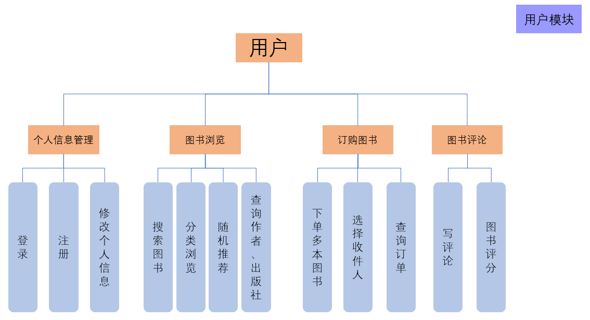
</div>

<div align="center">
    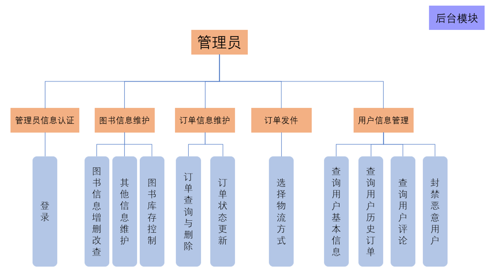
</div>

### 2.2 数据流图

​	经过分析，我们将系统功能与数据库的交互，总结为了一张数据流图。其中，淡蓝椭圆形，表示事务、操作。双下划线，表示实体数据库。箭头表示交互。

<div align="center">
    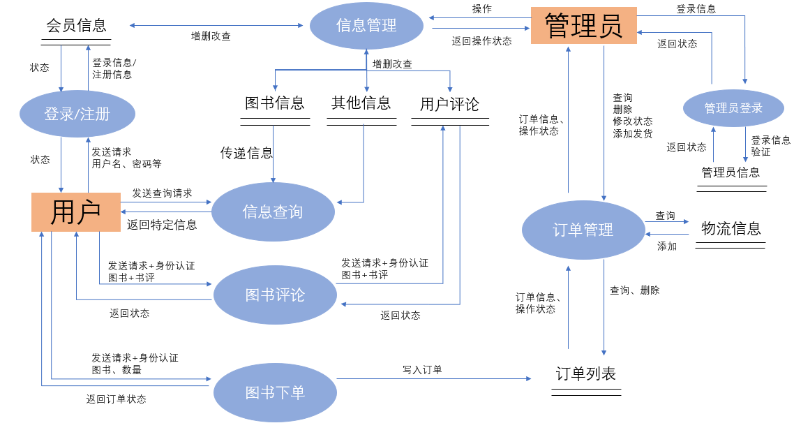
</div>

<div style="page-break-after:always;"></div>

# 3. 数据库设计

### 3.1 数据来源

​	我们的数据绝大部分来源于豆瓣读书，并设计了爬虫去爬取书籍信息、作者信息等。部分网络上没有的数据，如vip价格，我们自行根据爬取的标价而随机设置。

​	在爬取过程中，出现部分网页的数据不全、不同网页的格式不一样等问题，我们都已一一解决。并且我们使用mysql.connector模块，直接将python脚本连接至我们的数据库，每爬取一次信息就直接写入数据库，使用了游标进行插入处理，避免了中途格式转换的问题。

​	其代码可见 [https://github.com/LE-WH/Crawler_for_Database](https://github.com/LE-WH/Crawler_for_Database)

### 3.2 概念模型-ER图

 	我们根据以上分析，首先得到了如下的ER图，表示实体与属性的关系。

<div align="center">
    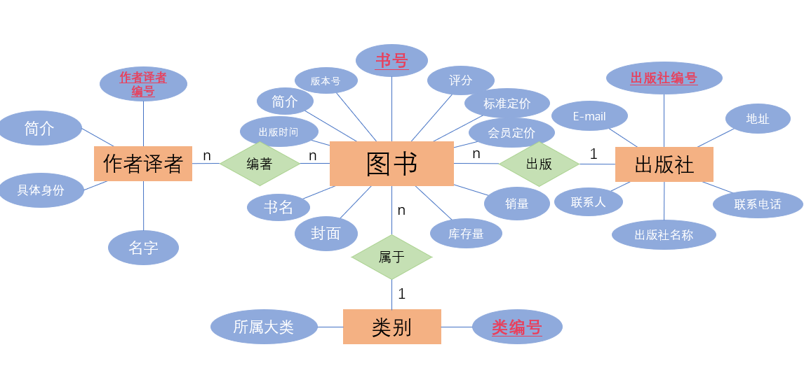
</div>

<div align="center">
    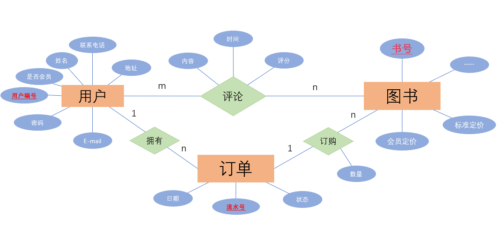
</div>

​	然后是整体的ER图：

<div align="center">
    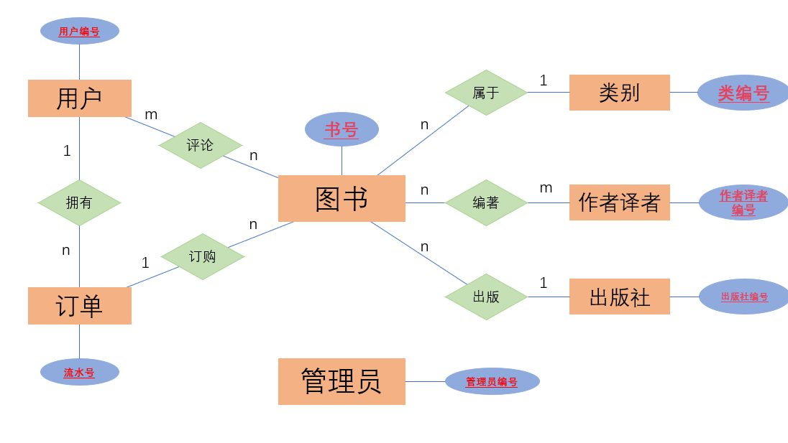
</div>

### 3.3 关系模型

​	在ER图的基础上，我们将数据结构划分为了如下关系表。其中划线部分为主键，画圈部分为外键。

<div align="center">
    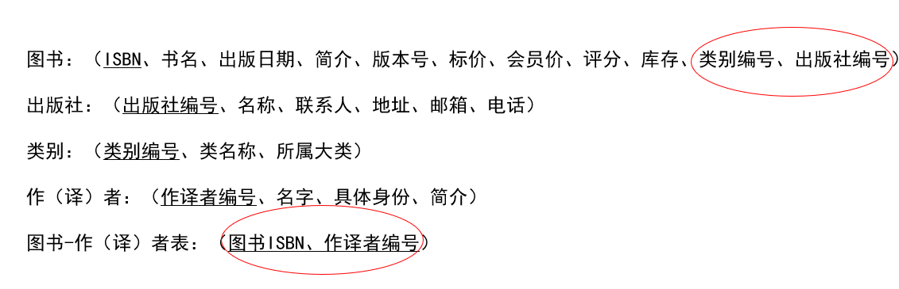
</div>

​	由于一本图书可能由多个作者共同编著，一个作者也会写多本图书。因此多对多的关系中，一个图书-作者表是需要的。

<div align="center">
    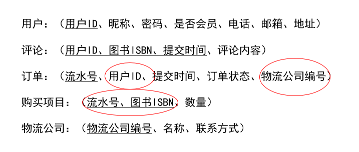
</div>

​	注意到一次订单中我们会在订单表中创建一行信息，然后每添加一个购买项目就会在购买项目表中额外添加一行信息。

​	对于已完成和未完成的订单，我们根据订单表中，提交时间是否为空来进行判断。

### 3.4 物理模型-EER图

​	最后我们基于实际情况，在以上的基础上进行了小的调整，最终实现了数据库系统，并且利用Mysql Workbench的逆向工程来绘制了以下EER图。

​	其中钥匙形状的是主键；实心表示非空约束，空心表示可以为NULL；红色表示外键约束；连接的箭头中有不同的方向，表示了一对多的关系。

<div align="center">
    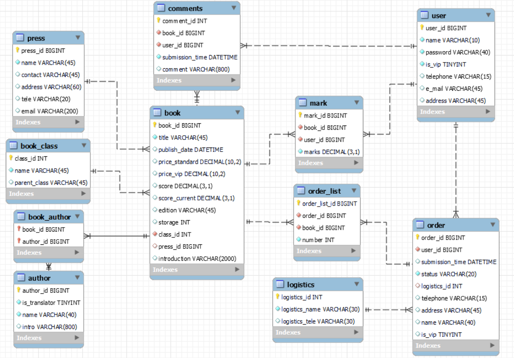
</div>


### 3.5 主键与ID
在主键的设置上，我们对除了Book表之外的每一个实体设置了具有唯一性约束的自增主键——ID，该设置有如下好处:
- id自增，添加数据时不用指定id，不用担心主键重复，可以快速添加。
- 基于B+树的InnoDB引擎表使得数据被存在B+树的叶子节点上，这就要求叶子节点各条数据按主键顺序存放，利用自增id作为主键，可以提升查询等操作的效率。
- 在数据库前后端交互时，大大提高了交互的便利性，增加了代码的易读性和系统的可扩展性。

Book表的主键为书籍的ISBN号，如此设置是为了保证数据库中书籍的可靠性。

### 3.6 其他设计
我们设计了索引、事务（针对高并发场景下可能发生的冲突）等内容来保障我们数据库的高性能和安全性，在第五节进行了详细阐述。值得一提的是，我们还对加不加索引的搜索时间进行了实验。

<div style="page-break-after:always;"></div>

# 4. 系统功能介绍

我们的系统主要分为用户系统、管理员系统、超级管理员系统。

### 4.1 用户系统介绍

用户系统主要实现图书信息浏览、书籍下单、评论评分的功能。此外会根据用户是游客、注册用户、会员的不同，来进行一些功能上的区分。

#### 4.1.1 游客浏览

当用户尚未注册登录的时候，将会以游客身份进行游览。

首先用户可以直接根据ip地址访问我们的主页。这里由于是部署在本机，所以直接在浏览器中输入http://127.0.0.1:8000/就可以进入主页。如果我们将系统部署在拥有公网ip的服务器上，则其他用户可以直接根据ip访问我们。

<div align="center">
    
</div>

除了访问主页以外，游客还可以进行搜索，分类查看。

当要查看书籍详细信息的时候，会出现以下界面，并自动跳转到登陆界面。也就是说除了以上功能以外，其余功能均需用户登录。

<div align="center">
    
</div>


#### 4.1.2 用户的注册与登录
用户注册和登录页面如下，值得注意的是我们对于一些特定字段加了校验，比如telephone，用户不可随意输入。

<div align="center">
    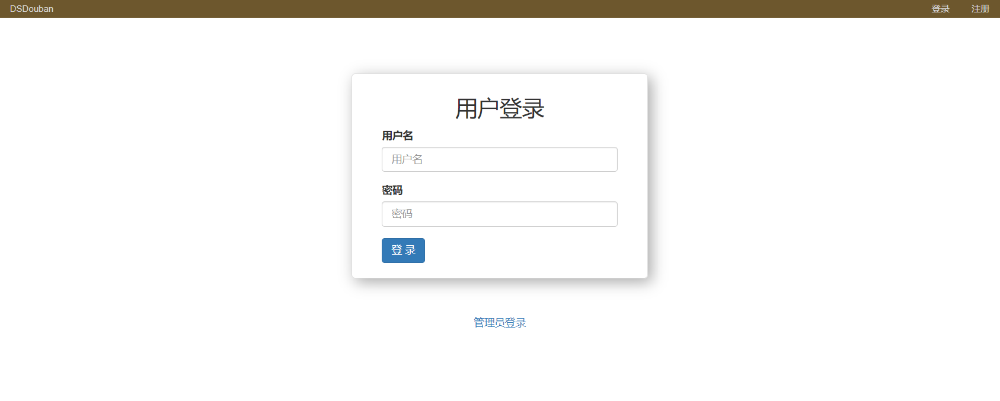
</div>

<div align="center">
    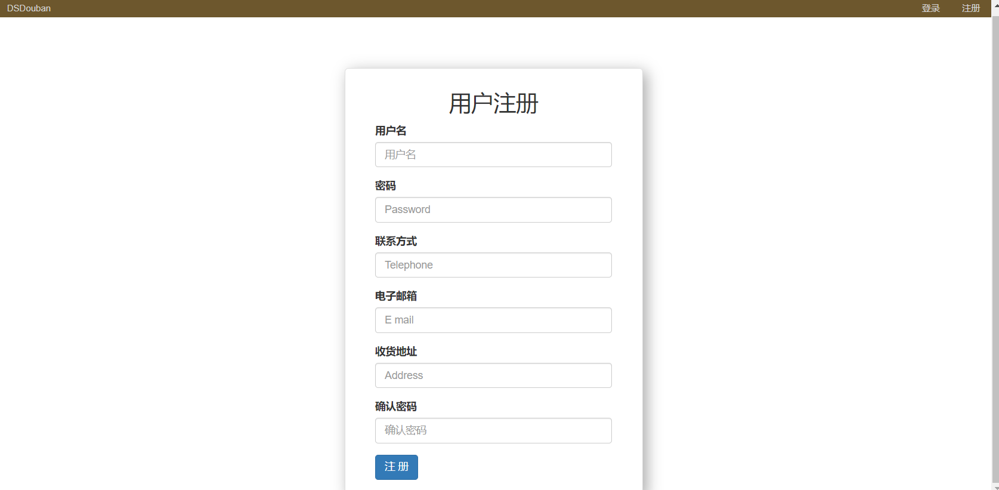
</div>

此外，由于我们是根据用户的用户名进行登录，因此在注册的时候我们会检查用户的用户名是否与其他人重合。

最后确认密码的时候如果输入不正确也不会成功注册。

注册完毕后会跳转到登录界面，登录后就会返回主页。如下图所示，注意右上角已经不再是登录/注册，而是显示用户名。

<div align="center">
    
</div>

#### 4.1.3 主要浏览页面介绍
**分类、模糊搜索和排序功能**

我们实现了同时分类、模糊搜索和排序功能。查询涵盖的字段有：书籍id，标题，出版社，简介和作者等；排序可以按照评分、价格和出版社编号排序；分类可以按照书籍的类别和子类进行分类。效果如下：

<div align="center">
    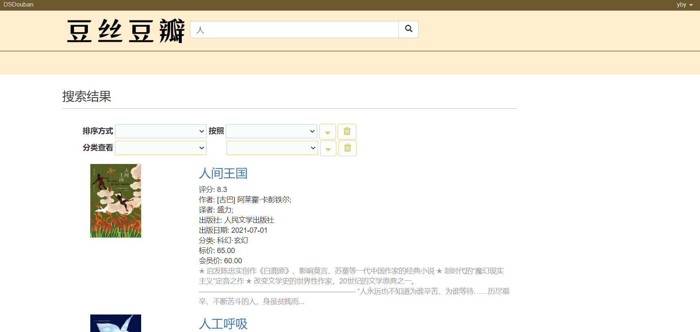
</div>

<div align="center">
    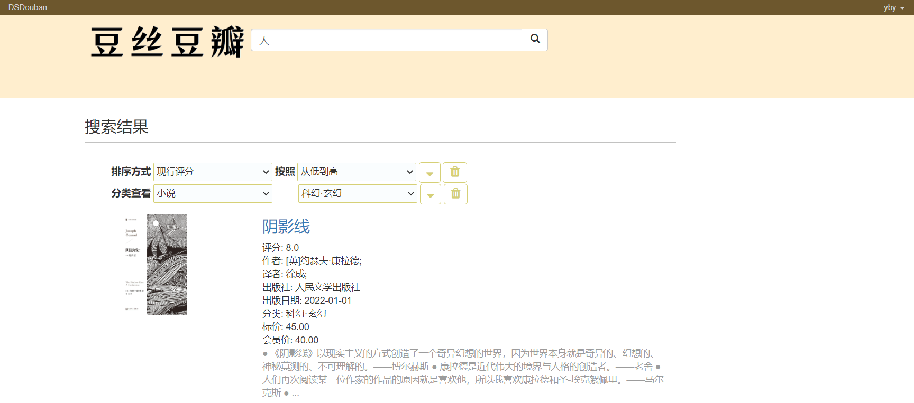
</div>
**书籍详细信息与评论评分**

在以上界面点击书名，用户就可以查看书籍的详细信息，界面如下：

<div align="center">
    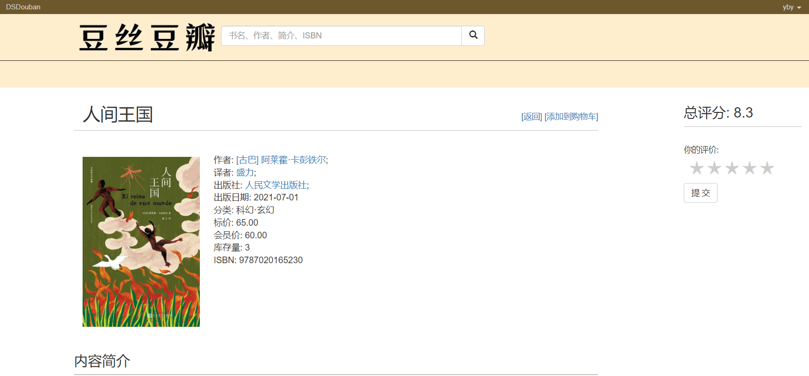
</div>

在详细信息页面可以进行评论与评分。评分后，评分数据会被统计到数据的平均评分中，可以看到右边的总评分发生了变化。

<div align="center">
    
</div>

我们的评分系统实际上不是单纯的平均评分，而是基于以下公式：总评分=（管理员设定分数*10+用户评分之和）/（10+用户评分数），来进行计算的。这样可以使得评分数较少的时候，变化更加光滑。

在页面最下方可以进行评论操作。

<div align="center">
    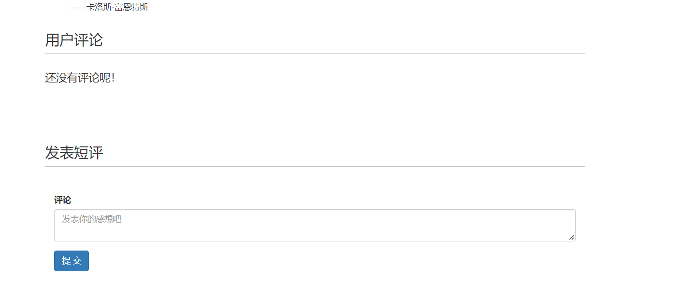
</div>

评论后，评论内容会被显示在书籍的详细信息页面，效果如下：

<div align="center">
    
</div>

我们也可以随时修改该评论，或者删除该评论。此外，这里会显示最后一次修改的时间。

#### 4.1.3 个人信息查询
用户可以在右上角选择查看个人资料、我的购物车和我的订单：

<div align="center">
    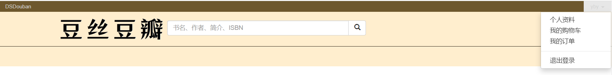
</div>

个人资料页面如下：

<div align="center">
    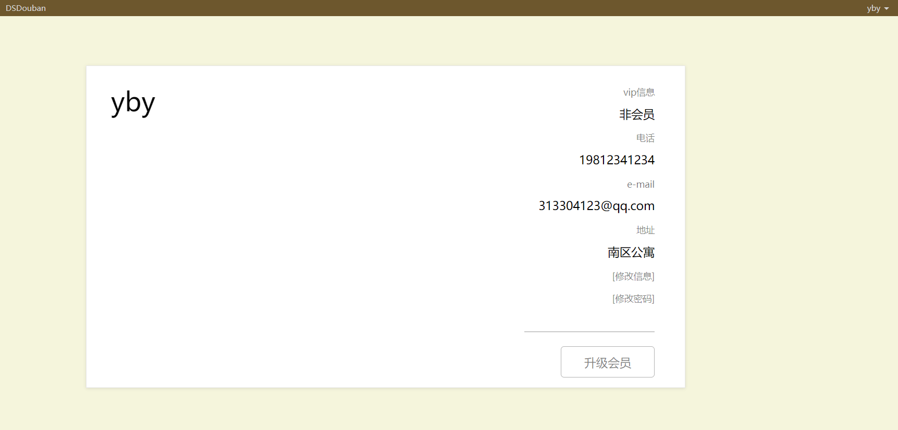
</div>

我们可以随时在这里修改个人信息，包括用户名、电话地址邮箱、和密码。（用户名的修改也会检查是否与其他人重名）

#### 4.1.4 VIP系统

可以看到在以上非会员的个人资料中，有升级会员的功能。点进入后：

<div align="center">
    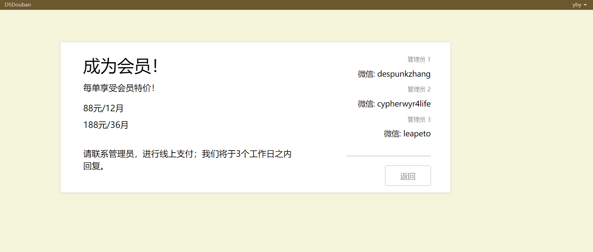
</div>

也就是说只需要联系管理员，进行其他渠道的支付后就可以成为会员。

而成为我们的vip后，vip用户在购买时就能享受到优惠价格。比如对同一本书而言，普通用户看到的价格为：

<div align="center">
    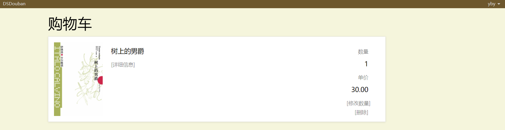
</div>

vip用户看到的价格为：

<div align="center">
    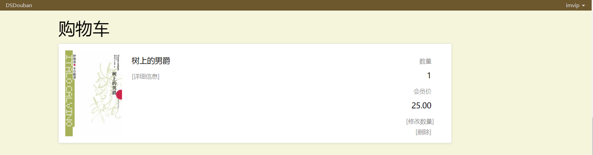
</div>

#### 4.1.5 订单系统
订单系统是我们数据库中最复杂的子系统之一，主要是因为订单的各种状态，并且兼容了购物车系统。在用户系统中，跟订单系统有关系的功能有：查看、修改购物车（未提交的订单），购买（提交未提交的订单），查看以往订单，更改订单状态（确认收货和取消订单）和将书籍加入到订单中等。下面将通过一个完整的流程来展示该系统：

首先，我们用普通用户添加一些订单，在“书籍详情”界面中，点击添加到购物车后，直接跳转到我们的购物车：

<div align="center">
    
</div>

我们可以看到在购物车上方，显示了这次订购的信息。由于我们可能不止为自己购买，可能想给亲友购买，因此可以在上方修改信息的链接中，将收件人、收件人电话、地址等信息作出修改。

然后看到下方，我们可以修改书籍的个数，下图中可以看到我们购买数量不能超过书籍已有数量。此外我们也无法设置为负数、小数等。

<div align="center">
    
</div>

然后我们也可以多下单几本书，然后进行提交：

<div align="center">
    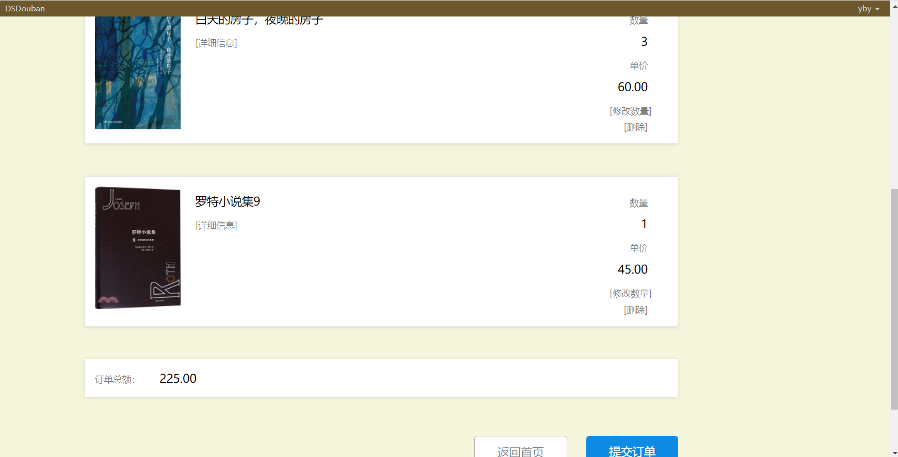
</div>

可以看到我们的系统可以自动计算价格。

订单提交后自动跳转到历史订单界面，可以在历史订单中看到以往订单。

<div align="center">
    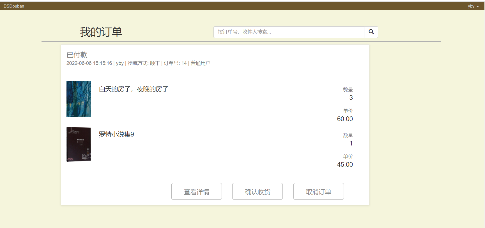
</div>

在右上角可以根据订单号或者收件人进行搜索。

此外，如果中途升级了VIP，历史订单也会将每笔交易的vip信息记录下来。在历史订单中可以看到价格的不同：

<div align="center">
    
</div>

我们再来看这张图，我们可以取消订单和确认收货来取消/完成订单。

<div align="center">
    
</div>

值得注意的是，当我们下单了一本书之后，会将书籍的库存量及时调整。在修改数量的时候，系统提醒我们，数量无法超过《白天的房子，夜晚的房子》的库存量18 。而现在我们下单了三本书之后，我们再来看一下库存量：

<div align="center">
    
</div>

而我们再取消订单：

<div align="center">
    
</div>

再来看库存量，发现回到了18 。

<div align="center">
    
</div>

此外，在下单之后，我们在未确认收货、未取消订单的状态下，我们可以进入查看详情界面，修改订单的基础信息，如收件人电话、地址之类的。

在确认收货、取消订单之后，则无法再进行修改了。

这样基本符合现实需求。

### 4.2 普通管理员系统介绍
在我们的管理员系统中，我们区分了普通管理员和超级管理员。下面将一一介绍。

#### 4.2.1 图书管理系统

我们的普通管理员系统涉及到的功能如下，其中管理员管理页面中只能看到各管理员的用户名。

<div align="center">
    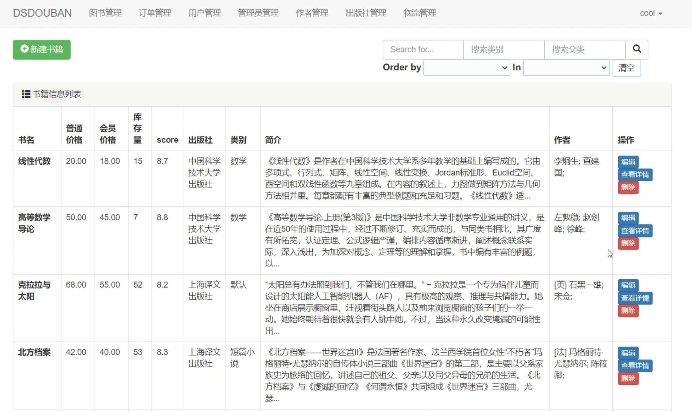
</div>

从图书管理的页面中就可以看出我们有增删查改功能，其中修改功能中，对于有外键约束的字段，我们设置只能进行下拉选择。
<div align="center">
    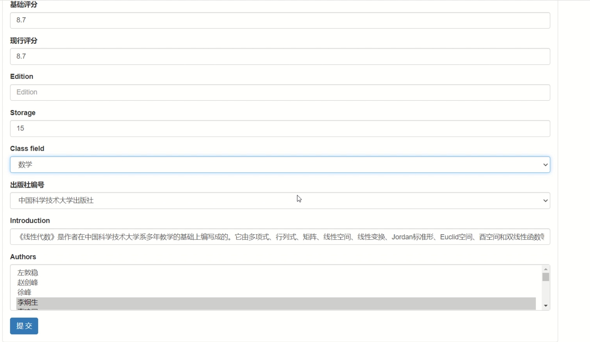
</div>

- 订单管理中，对于不同状态的订单，管理员能做的操作不同。对于已付款未完成的订单，管理员有权修改所有内容，对于已完成的订单，管理员只能修改订单系统中与书籍无关的内容，如用户信息和物流信息。
- 对于有外键约束的数据，我们设置的是不可删除。

#### 4.2.2 订单管理系统

订单管理系统如下：

<div align="center">
    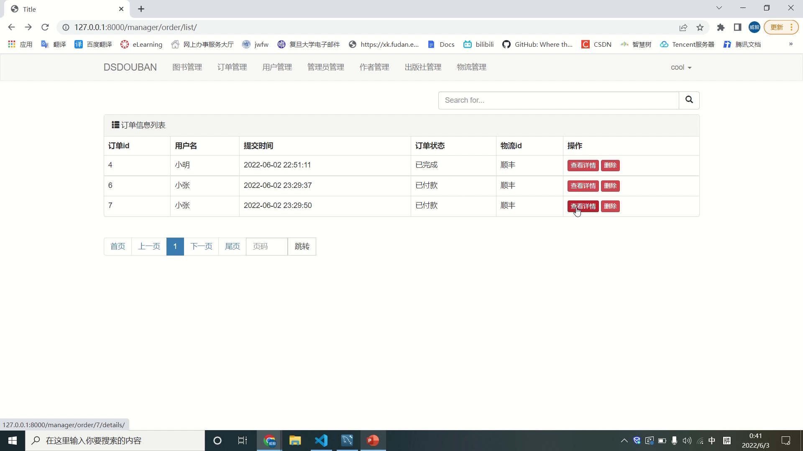
</div>

对于已付款的订单，管理员可以在查看详情中进行所有信息的编辑

<div align="center">
    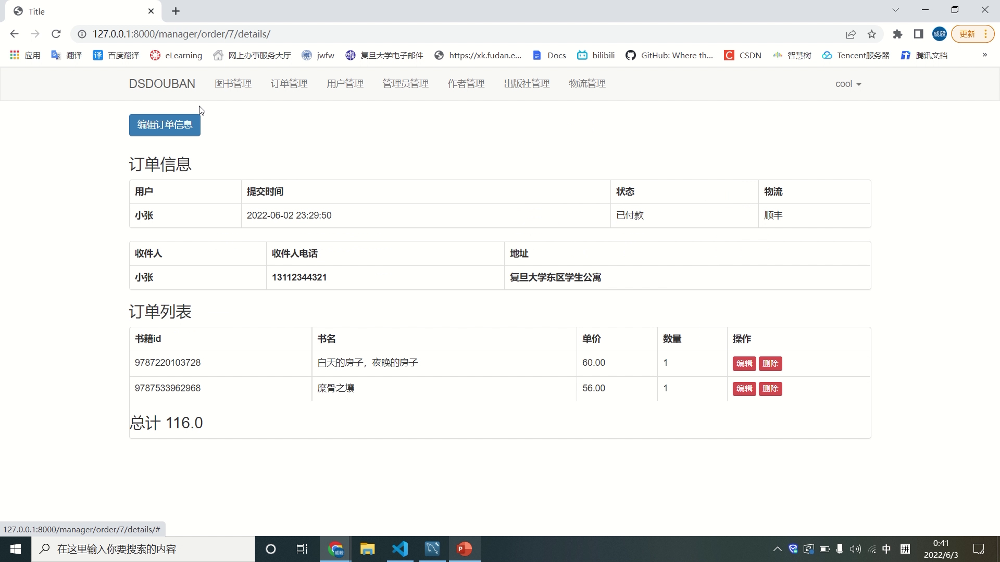
</div>

对于已完成的订单，只能查看详情，不能修改

<div align="center">
    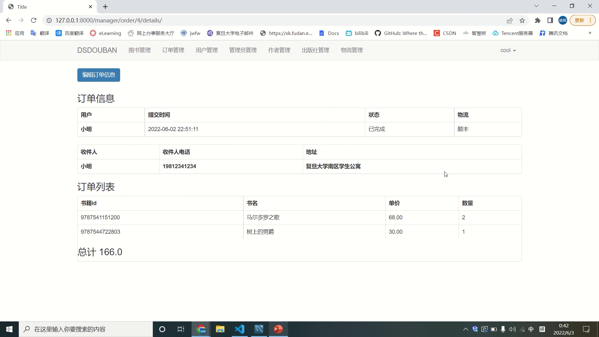
</div>

#### 4.2.3 用户管理系统

用户管理系统界面如下：

<div align="center">
    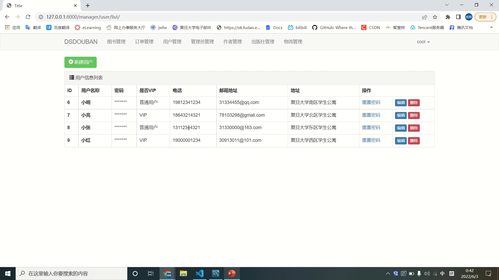
</div>

管理员可以重置用户的密码，编辑用户（用户名称和vip信息）或删除用户

<div align="center">
    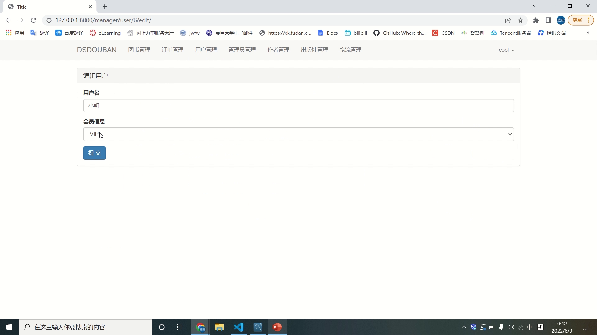
</div>

#### 4.3.4 作者管理系统

作者管理系统界面如下：

<div align="center">
    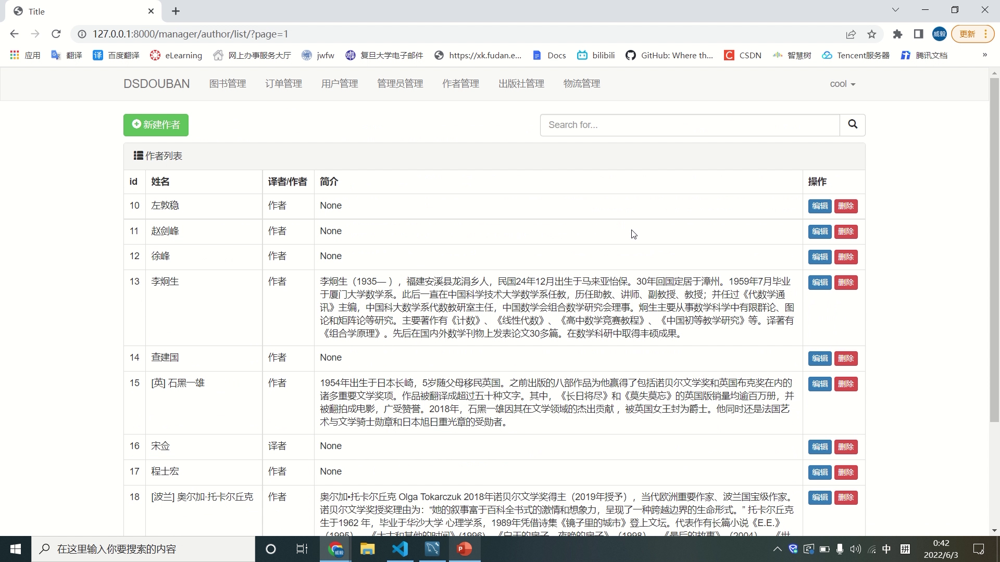
</div>

我们将作者和译者放在一张表中，由于作者有外键约束，我们无法直接删除作者，只有将作者在数据库中对应的书籍全部删去之后，才可以删除作者，否则会出现如下错误提示

<div align="center">
    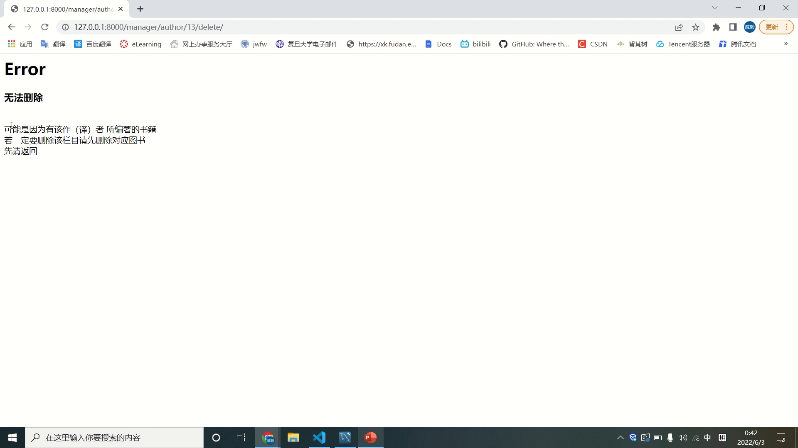
</div>

#### 4.3.5 出版社管理 & 物流管理

出版社管理的界面如下：

<div align="center">
    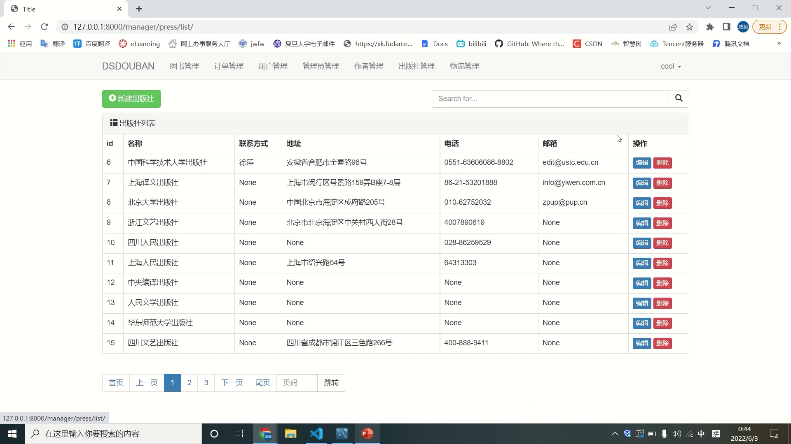
</div>

物流管理的界面如下：

<div align="center">
    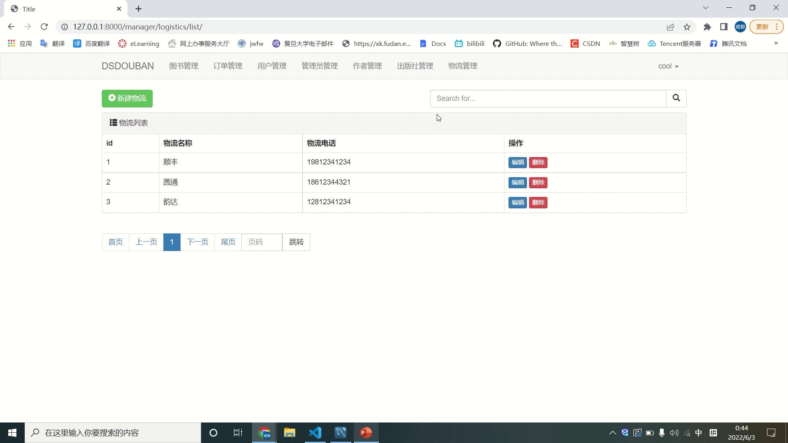
</div>

与作者管理相同，当外键约束依然存在时，删除出版社或物流公司会出现相应的错误提示。

### 4.3 超级管理员系统

#### 4.3.1 超级管理员创建

超级管理员与django自带的管理员admin系统兼容，可以用superuser进行注册。具体代码如下：
```python
python manage.py createsuperuser
# Enter Username:
# Enter Email address:
# Enter Password:
# Enter Password(again):
```
#### 4.3.2 修改密码

由于我们的数据库保护得很好，采用的是PDKBF2加密方法，密码经过哈希存在数据表中，不能直接从用户表对用户密码进行操作。而是需要从封装的函数当中修改密码。也可以从之后介绍的界面中修改密码。

```python
python manage.py changepassword 'username'
```

#### 4.3.3 登录

我们采用的是django框架自带的管理员界面，因此其站点为http:/127.0.0.1:8000/admin。登录后进入以下界面，输入之前创建的用户。

<div align="center">
    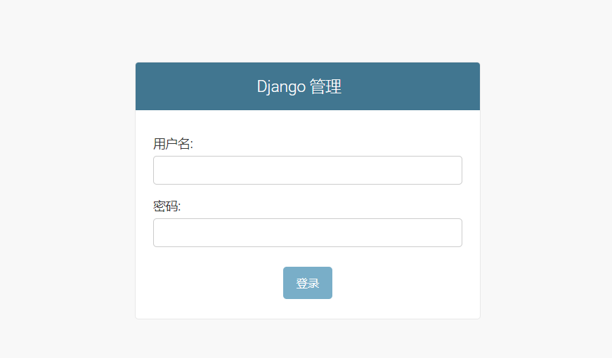
</div>

进入如下页面即成功登录。可以看到右边显示了最近该超级管理员账户的所有操作。

<div align="center">
    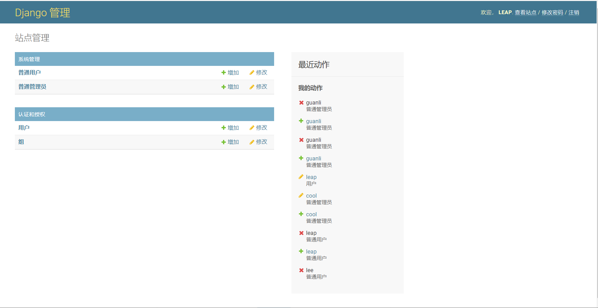
</div>

#### 4.3.4 系统管理

超级管理员系统中，主要的功能是对普通用户、普通管理员的增删查改。

例如，点击“普通管理员”，可以看到如下信息：

<div align="center">
    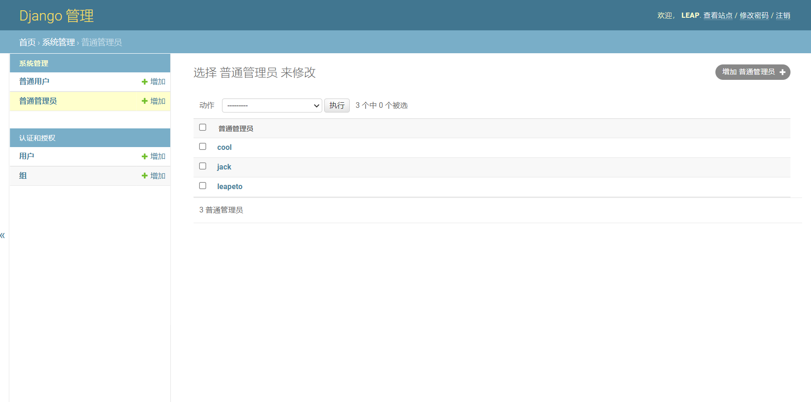
</div>

我们可以在右上角新建普通管理员，也可以删除单个普通管理员，或批量删除普通管理员。如下所示。

<div align="center">
    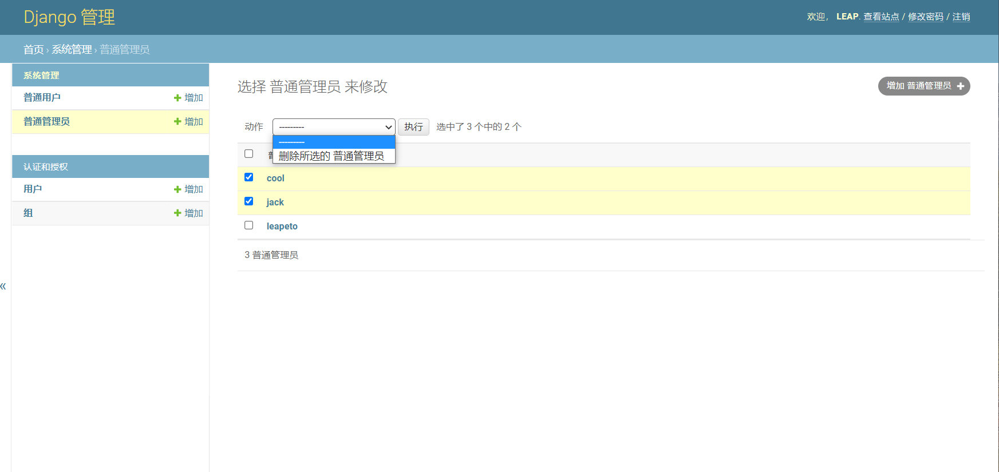
</div>

而对普通用户的增删查改也是类似的，这里不详细展开。

#### 4.3.5 其他超级管理员的权限设置

超级管理员还可以创建其他超级管理员，并且设置他们的权限。

点击认证和授权->用户，可以看到当前所有超级管理员的信息。

<div align="center">
    
</div>

点击一个超级管理员，可以修改该超级管理员的资料与权限。下图是权限设置。可以看到，对一个用户可以分别设置对任何表的增删查改的权限。注意到上面有一个“组”。一个组指的是一个拥有一定权限的集合，当我们将一个超级管理员添加到一个组之后，就会自动享有该组所拥有的一切权限。相当于是简化了一个一个添加用户权限的操作。

<div align="center">
    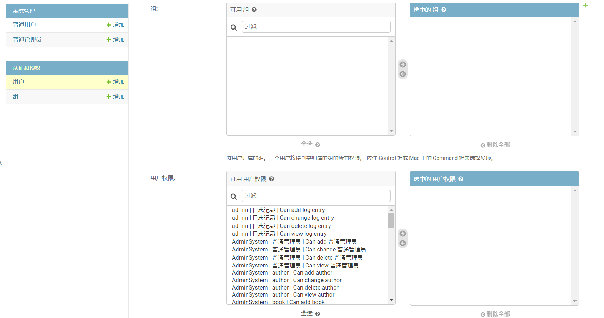
</div>

我们也可以点击认证和授权->组，来创建一个新的组。

<div align="center">
    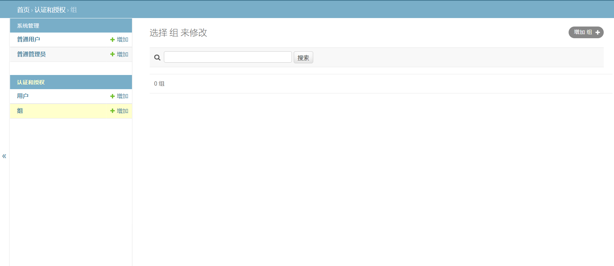
</div>

<div align="center">
    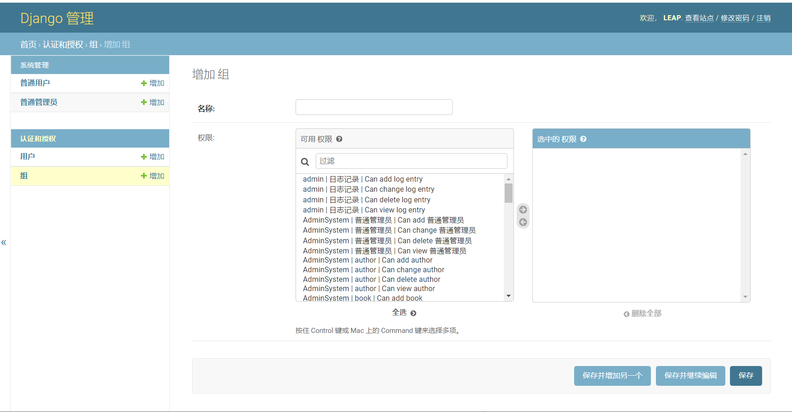
</div>

可以看到我们可以指定一个组所拥有的权限。创建完成后，再创建一个新的超级管理员，就可以直接拉进组，省去了添加权限的操作。

<div style="page-break-after:always;"></div>

# 5. 性能优化与安全性设计

### 5.1 高性能设计
#### 5.1.1 索引设计与实验
根据高性能Mysql原理，在经常需要搜索且取值范围不小的字段中，我们建立了索引和联合索引以加快搜索速度。比如对于图书表，我们建立了（书名）索引以及（作者，类别名）联合索引等。

我们特地对于书名Title字段做了加不加索引的速度对比：我们首先生成了随机中文书名的20000条书籍的数据：
```python
def Unicode():
    val = random.randint(0x4e00, 0x9fbf)
    return chr(val)

def gen_random_book():
    author_tmp = models.Author.objects.all().first()
    for i in range(20000):
        title_num = random.randint(4,8)
        title_tmp = ""
        for j in range(title_num):
            title_tmp = title_tmp + Unicode()
        
        book=models.Book(book_id=i+100,title = title_tmp)
        book.save()
```
然后用“人”对Book中的Title字段进行查询，分别在对Title加了索引和不加索引的情况下进行了10000次搜索，最后结果如下：


| 加索引 | 不加索引 |
| :------: | :------: | 
| 4s | 6s |

可见在数据量较小（即使已经达到了两万）的情况下，加了索引的效果更好。
#### 5.1.2 搜索分页
在搜索的时候，我们采用了分页功能，每次只从搜索结果中提取一部分数据来显示。

由于django框架需要时间来对返回的数据进行渲染，因此一次只渲染一小部分，在查询结果很大的时候，可以大大加快查询速度。

### 5.2 安全性设计
#### 5.2.1 数据完整性
数据完整性是数据库安全性中非常重要的一部分，我们主要以管理员对数据的增删改来体现我们在完整性上的保障。
在管理员添加或者修改数据时，对于有外键约束的字段，我们提供的都是选项，而不能让管理员任意填写。
对于所有外键关系，如果某一数据是其他表中某数据的外键，则我们会提示有外键约束，不可删除。

#### 5.2.2 事务机制
数据库的事务是一种机制、一个操作序列，包含了一组数据库操作命令。事务把所有的命令作为一个整体一起向系统提交或撤销操作请求，即这一组数据库命令要么都执行，要么都不执行，因此事务是一个不可分割的工作逻辑单元。在数据库系统上执行并发操作时，事务是作为最小的控制单元来使用的，特别适用于多用户同时操作的数据库系统。例如，航空公司的订票系统、银行、保险公司以及证券交易系统等。

我们在有可能在高并发场景下发生冲突的操作中，比如订单系统中的如提交订单等，都添加了事务操作，以防出现订单中书籍数目异常（大于storage）的情况。

django中自带了事务相关的操作，使用的简介如下：
```python
# 显式的开启一个事务
with transaction.atomic():
  # 创建保存点
  save_id = transaction.savepoint()
  try:
    # 这部分代码会在事务中执行
    ....
    if (订单异常):
      raise ValidationError("xxx")
  except:
    # 回滚到保存点
    transaction.savepoint_rollback(save_id)
    return ...
 
  # 提交从保存点到当前状态的所有数据库事务操作
  transaction.savepoint_commit(save_id)
```
在我们加了事务操作后，就不会出现订单中部分书籍购买成功，而其他书籍购买失败，更新不同步的情况了。

#### 5.2.3 MD5加密
对于用户和管理员的密码，我们采用了MD5码加密，对于管理员密码，我们采用了更安全的PBKDF2密码加密。加密算法的大致逻辑就是对用户输入的密码进行一个映射，并且保存到数据库中，当用户登录时，就会把登录时输入的密码进行映射后跟数据库中存的密码进行比对。

#### 5.2.4 防止SQL注入
我们采用了多种方法来防止SQL注入，分别是：1、在用户需要提交信息时，我们会对其提交的表单进行校验；2、我们使用django的ORM来进行SQL语句的预编译以及字符串的参数化转化。

对于第一个方法，我们每次在保存用户提交的表单之前都会检验，比如在用户注册时，我们用正则表达式来检验用户的手机号是否符合规则，如不符合规则，用户无法提交：
<div align="center">

</div>
对于第二个方法，我介绍一下其原理：

```python
#不使用字符串而使用字符串参数来拼接查询条件
query = """SELECT * FROM Book WHERE name = %s """
#参数化查询
books = Book.objects.raw(query,[book_title])
```

这样就可以在查询条件上自动加上引号，从而防止SQL注入，而我们使用的所有函数比如filter(),update()方法中均已经使用了这种方法。

#### 5.2.5 防止CSRF攻击
​	CSRF是跨站点请求伪造(Cross—Site Request Forgery)，存在巨大的危害性。
​	简单来说：一个正常用户访问了网站A，然后不小心访问到了恶意网站B。网站B利用用户浏览器的cookie向网站A发送恶意请求，网站A由于只验证一些cookie信息而将这些操作视为用户本人的操作。比如发送邮件、发消息，盗取账号，添加系统管理员，甚至于购买商品、虚拟货币转账等。

​	django自带了一个防止csrf攻击的功能，我们也采用了这个功能，但是为了正常使用，我们还需要在用户提交的表单中加入以供网站进行验证。

​	其原理是，当用户通过浏览器访问我们的表单界面的时候，我们会生成一个随机的字符串作为表单的一项。当用户提交表单的时候，如果这个字符串与我们最开始随机生成的字符串是匹配的，那么我们认为这个用户是通过正常方式访问我们的页面提交的表单。如果发现不一样，那么很可能是用户通过其他方式访问的。而由于恶意网站无法提前猜到随机字符串，也无法获得用户收到的随机字符串，因此恶意网站无法绕过这个csrf_token来达到目的，我们就可以这样防止CSRF攻击。

#### 5.2.6 页面访问权限管理
​	我们通过django的中间件来进行页面的访问权限管理，具体而言，未注册的游客不得访问用户页面，用户不得访问管理员页面，普通管理员不得访问超级管理员页面。简单概括如下：
<div align="center">

</div>
当我们作为用户登录时，尝试访问管理员页面，会有如下结果：
<div align="center">

</div>
​	我们在用户或者管理员登陆时，会将他是用户或者是管理员的信息存入session的info中，而我们又用了中间件，在每次访问页面之前，django会先运行中间件的代码，来检查session中的信息，以判断用户是否有权限访问某些页面。部分代码如下：

```python
# 1.读取当前访问的用户的session信息，如果登录过，按照用户是user还是admin分类讨论。
info_dict = request.session.get("info")
if info_dict:
    if info_dict['auth'] == "admin":
        return
    else:
        if re.match('/dsdouban/*', request.path_info):
            return
        else:
            title = "您无管理员权限。"
            skiplink = "/"
            print(skiplink)
            return render(request, 'warning.html', {"title": title, "skiplink": skiplink})

# 2.没有登录过，重新回到登录页面
title = "您未登录。"
skiplink = "/dsdouban/login/"
return render(request, 'warning.html', {"title": title, "skiplink": skiplink})
```
通过这样的权限管理，我们就保证了我们的表不会被随意篡改。

<div style="page-break-after:always;"></div>

# 6. 开发平台及框架
数据库为: MySQL 8.0, OceanBase 

后端编程语言为: Python3.8 

前端编程语言为: HTML, CSS

前端框架使用: Django 3.2 和 Bootstrap 3

连接网页和数据库: mysqlclient 2.0.3 

所有的python环境依赖包都写入了requirements.txt。

<div style="page-break-after:always;"></div>

# 7. 系统安装部署说明

本系统可在Windows平台、OSX平台下安装。Linux系统不保证兼容性。

### 7.1 创建环境

首先请根据requirements.txt创建对应的python环境，确保所有环境依赖包都已经安装成功。

### 7.2 创建数据库导入数据文件
请在cmd环境中运行以下指令。

注意先登录mysql控制台，再使用source指令，同时source指令需要没有空格和中文的绝对地址，且不加分号。

```
mysql -u root -p
create schema DSDouBan;
use DSDouBan;
source your/path/to/Dump20220523.sql
```
### 7.3 配置django中的数据库

将这里的password改为本机mysql的root的密码。

```
于文件 DSDouBan\settings.py 第81行数据库配置：
DATABASES = {
    'default': {
        'ENGINE': 'django.db.backends.mysql',
        'NAME': 'DSDouBan',
        'USER':'root',
        'PASSWORD':'your_password',
        'HOST': '127.0.0.1',
        'PORT': '3306',
    }
}
```
### 7.4 将剩余的model注册到数据库中

请在python环境中运行以下指令：

```
python manage.py makemigrations
python manage.py migrate
```

### 7.5 跑起来！
```
python manage.py runserver
```
打开浏览器并访问 http://127.0.0.1:8000/ 即可进入数据库系统。

### 7.6 注意事项

​	由于我们主要在Windows平台，以Chrome作为浏览器开发，因此使用其他浏览器或者在其他操作系统如OSX的情形下，仍然是可以运行的，但显示界面会略微有所差别，可能会出现一些意料之外的显示问题。因此建议使用Windows平台且使用Chrome浏览器打开。

​	此外，理论上作为管理员是无法进入用户系统的，没有任何界面或者按钮可以进入。如果通过改变url栏是可以进入的，但可能产生bug。考虑到管理员应该是公司自己人，不存在管理员恶意触发bug，因此请不要在使用管理员身份的情况下进入用户界面。如果进入了也可以随时注销，重新登录一个用户账号。

<div style="page-break-after:always;"></div>

# 8. 分布式系统

我们基于OceanBase设计了该数据库的分布式版本，并在有限的条件下完成了一些实验。

### 8.1 分布式特性

分布式数据库有如下特性

- 数据高可扩容性
- 操作高并发性
- 数据高可用性
- 数据安全性

为了体现上述特性，我们使用OceanBase的如下技术：

- 分区技术
- 物理备份与恢复技术

由于今年无法使用官方服务器，实验仅基于单一zone单一server自行组建的oceanbase本地服务器开展。

### 8.2 OceanBase服务器搭建

#### 8.2.1 Docker容器部署

以下OceanBase服务器搭建基于MacOS Monterey 12.3.1以及Docker Desktop 4.5.0(74594)

由于基于M1 Mac的docker官方镜像尚未上线，故使用DIY镜像完成docker容器的搭建，具体可见[OceanBase社区问答](https://open.oceanbase.com/ask/detail?id=31400008&pageNo=1#常见FAQ)。注意该问答中并没有安装obd供用户进行集群的部署与创建，可以通过该[镜像](https://mirrors.aliyun.com/oceanbase/community/stable/el/7/aarch64/ob-deploy-1.3.3-11.el7.aarch64.rpm)下载相关rpm包（windows用户只需跟随官方教程即可）。

#### 8.2.2 集群设置

由于机器性能有限，参照官方的[single-example.yaml](https://github.com/oceanbase/obdeploy/blob/master/example/single-example.yaml)进行配置，注意修改IP、内存等信息

使用以下指令部署集群

```bash
obd cluster deploy dsdouban -c single.yaml
obd cluster start dsdouban
obd cluster list
+----------------------------------------------------------+
|                       Cluster List                       |
+----------+-----------------------------+-----------------+
| Name     | Configuration Path          | Status (Cached) |
+----------+-----------------------------+-----------------+
| dsdouban | /root/.obd/cluster/dsdouban | running         |
+----------+-----------------------------+-----------------+

```

可见此时集群已经部署，使用obclient进行登陆

```bash
obclient -h127.0.0.1 -P2881 -uroot -p
```

即可登录集群的root账号

#### 8.2.3 创建租户

首先创建资源单元格

```mysql
USE oceanbase;
CREATE RESOURCE UNIT unit_name 
    MAX_CPU [=] cpu_num, 
    MAX_MEMORY [=] mem_size, 
    MAX_IOPS [=] iops_num, 
    MAX_DISK_SIZE [=] disk_size, 
    MAX_SESSION_NUM [=] session_num, 
    [MIN_CPU [=] cpu_num,]
    [MIN_MEMORY [=] mem_size,] 
    [MIN_IOPS [=] iops_num] ;
    
-- 可以使用select * from __all_unit_config 查看已创建的单元格
```

接下来创建资源池

```mysql
CREATE RESOURCE POOL poolname 
  UNIT [=] unitname, 
  UNIT_NUM [=] unitnum, 
  ZONE_LIST [=] ('zone' [, 'zone' …]);

-- 可以使用 select * from __all_resource_pool 查看已创建的资源池
```

最后创建租户

```mysql
CREATE TENANT IF NOT EXISTS ds_tenant
charset='utf8mb4',
replica_num = 1,
zone_list = ('zone1'),
primary_zone = 'zone1',
resource_pool_list = ('dsdouban');

SELECT * FROM gv$tenant
+-----------+-------------+-----------+--------------+----------------+---------------+-----------+---------------+
| tenant_id | tenant_name | zone_list | primary_zone | collation_type | info          | read_only | locality      |
+-----------+-------------+-----------+--------------+----------------+---------------+-----------+---------------+
|         1 | sys         | zone1     | zone1        |              0 | system tenant |         0 | FULL{1}@zone1 |
|      1001 | ds_tenant   | zone1     | zone1        |              0 |               |         0 | FULL{1}@zone1 |
+-----------+-------------+-----------+--------------+----------------+---------------+-----------+---------------+
2 rows in set (0.002 sec)
```

### 8.3 分布式系统使用

#### 8.3.1 分区技术

分区技术是OceanBase的一大技术亮点，其思想在于将大表进行拆分，形成结构相同但更为小巧的独立对象，分别存储在多个服务器节点之内，并通过OBProxy或OBServer将用户SQL路由到相应节点内，这样就可以解决大表的容量问题和高并发查询需求。同时，OceanBase还使用表组对分区表进行管理，来提高跨表查询的效率。OceanBase将表组作为表的属性，对同一个表组中的表的同好分区会管理为一个分区组，对于同一个分区组中的分区，OceanBase会尽量将其调度至一个节点之内，以避免跨节点的请求。

对于我们的数据库而言，可以对图书的分类进行分区，这样可以大大的提高用户分类搜索的性能，也可以改善书城由于图书数量日益增多带来的数据存储压力。

#### 8.3.2 分区技术体验

我们在自己搭建的OceanBase服务器上进行了以下体验

```bash
# 登陆已经创建好的资源池
obclient -h127.0.0.1 -P2881 -uroot@ds_tenant -p
```

```mysql
CREATE DATABASE dsdouban;
USE dsdouban;
-- 导入准备好的.sql文件
SOURCE /home/admin/oceanbase.sql

-- 我们对book和book_class表的class_id属性进行了分区
SHOW CREATE TABLE book;
| book  | CREATE TABLE `book` (
  `book_id` bigint(20) NOT NULL,
  `title` varchar(45) NOT NULL,
  `publish_date` datetime DEFAULT NULL,
  `price_standard` decimal(10,2) DEFAULT NULL,
  `price_vip` decimal(10,2) DEFAULT NULL,
  `score` decimal(3,1) DEFAULT NULL,
  `score_current` decimal(3,1) DEFAULT NULL,
  `edition` varchar(45) DEFAULT NULL,
  `storage` int(11) DEFAULT NULL,
  `class_id` int(11) NOT NULL DEFAULT '0',
  `press_id` bigint(20) DEFAULT NULL,
  `introduction` varchar(2000) DEFAULT NULL,
  PRIMARY KEY (`book_id`, `class_id`),
  CONSTRAINT `press_id` FOREIGN KEY (`press_id`) REFERENCES `dsdouban`.`press`(`press_id`) ON UPDATE RESTRICT ON DELETE RESTRICT ,
  CONSTRAINT `classification_id` FOREIGN KEY (`class_id`) REFERENCES `dsdouban`.`book_class`(`class_id`) ON UPDATE CASCADE ON DELETE RESTRICT ,
  KEY `classification_id_idx` (`class_id`) BLOCK_SIZE 16384 LOCAL,
  KEY `press_id_idx` (`press_id`) BLOCK_SIZE 16384 LOCAL
) DEFAULT CHARSET = utf8mb4 ROW_FORMAT = COMPACT COMPRESSION = 'zstd_1.3.8' REPLICA_NUM = 1 BLOCK_SIZE = 16384 USE_BLOOM_FILTER = FALSE TABLET_SIZE = 134217728 PCTFREE = 0
 partition by list(class_id)
(partition defaultclass values in (0),
partition math values in (1),
partition scifi values in (2),
partition romance values in (3),
partition poetry values in (4),
partition shortnovel values in (5),
partition hisnovel values in (6),
partition suspense values in (7)) |

SHOW CREATE TABLE book_class;
| book_class | CREATE TABLE `book_class` (
  `class_id` int(11) NOT NULL AUTO_INCREMENT,
  `name` varchar(45) NOT NULL,
  `parent_class` varchar(45) DEFAULT NULL,
  PRIMARY KEY (`class_id`)
) AUTO_INCREMENT = 1000009 DEFAULT CHARSET = utf8mb4 ROW_FORMAT = COMPACT COMPRESSION = 'zstd_1.3.8' REPLICA_NUM = 1 BLOCK_SIZE = 16384 USE_BLOOM_FILTER = FALSE TABLET_SIZE = 134217728 PCTFREE = 0
 partition by list(class_id)
(partition defaultclass values in (0),
partition math values in (1),
partition scifi values in (2),
partition romance values in (3),
partition poetry values in (4),
partition shortnovel values in (5),
partition hisnovel values in (6),
partition suspense values in (7)) |

-- 创建对应的表组
CREATE TABLEGROUP grp_by_list
PARTITION BY LIST
(
  partition defaultclass values in (0),
	partition math values in (1),
	partition scifi values in (2),
	partition romance values in (3),
	partition poetry values in (4),
	partition shortnovel values in (5),
	partition hisnovel values in (6),
	partition suspense values in (7));
	
-- 将表添加到表组
ALTER tablegroup grp_by_list add book;
ALTER tablegroup grp_by_list add book_class;
show tablegroups;
+-----------------+------------+---------------+
| Tablegroup_name | Table_name | Database_name |
+-----------------+------------+---------------+
| grp_by_list     | book       | dsdouban      |
| grp_by_list     | book_class | dsdouban      |
| oceanbase       | NULL       | NULL          |
+-----------------+------------+---------------+
3 rows in set (0.006 sec)
```

这样就完成了分区表以及表组的创建，由于条件有限，只能在单zone单server上进行实验，故无法展现OceanBase分区技术的全部威力。在分布式的情况下，OBClient或OBProxy会保证统一表组内的表尽可能的出现在同一节点上，可以大大的加速多表连接等操作的性能，避免跨节点通信带来的额外开销。

#### 8.3.3 物理备份与恢复技术

备份恢复是OceanBase数据库高可用特性的核心组建，用于保障数据安全，以防数据由于物理存储介质损坏和用户的误操作而丢失。备份后若出现以上情况而导致数据丢失，可以通过恢复技术恢复用户的数据。

OceanBase数据恢复技术的具体流程如下：

- 创建恢复用的租户
- 恢复租户的系统表数据
- 恢复租户的系统表日志
- 调整恢复租户的元信息
- 恢复租户的用户表数据
- 恢复租户的用户表日志
- 恢复扫尾工作

#### 8.3.4 物理备份与恢复技术体验

首先对我们创建的dsdouban数据库进行备份

```mysql
USE oceanbase; -- 在root用户下选择oceanabse数据库
ALTER SYSTEM SET backup_dest='file:///home/admin/backup'; -- 设置NFS为备份目的端
ALTER SYSTEM ARCHIVELOG; -- 启动日志备份
SELECT * FROM CDB_OB_BACKUP_ARCHIVELOG_SUMMARY; -- 确认日志备份任务是否已开始，当状态进入running时表明备份任务已开始
ALTER SYSTEM MAJOR FREEZE; -- 对集群发起一轮每日合并
SELECT * FROM __all_zone WHERE name='merge_status'; -- 查看合并进度
SET ENCRYPTION ON IDENTIFIED BY 'password' ONLY; -- 设置备份密码
ALTER SYSTEM BACKUP DATABASE; -- 发起数据备份
SELECT * FROM CDB_OB_BACKUP_PROGRESS; -- 查看正在备份的任务
SELECT * FROM CDB_OB_BACKUP_SET_DETAILS; -- 查看备份任务的历史
+-------------+-----------+--------+---------+-------------+-----------------+----------------------------+----------------------------+------------------+------+------------+-------------+------------+--------------+-------------------+-------------------+----------------------+---------------------------+--------------------+-----------+
| INCARNATION | TENANT_ID | BS_KEY | COPY_ID | BACKUP_TYPE | ENCRYPTION_MODE | START_TIME                 | COMPLETION_TIME            | ELAPSED_SECONDES | KEEP | KEEP_UNTIL | DEVICE_TYPE | COMPRESSED | OUTPUT_BYTES | OUTPUT_RATE_BYTES | COMPRESSION_RATIO | OUTPUT_BYTES_DISPLAY | OUTPUT_RATE_BYTES_DISPLAY | TIME_TAKEN_DISPLAY | STATUS    |
+-------------+-----------+--------+---------+-------------+-----------------+----------------------------+----------------------------+------------------+------+------------+-------------+------------+--------------+-------------------+-------------------+----------------------+---------------------------+--------------------+-----------+
|           1 |         1 |      1 | 0       | D           | PASSWORD        | 2022-06-02 12:13:57.548618 | 2022-06-02 12:16:12.210477 |              135 | NO   |            | FILE        | NO         |      3530152 |        26214.9359 |              0.04 | 3.37MB               | 0.03MB/S                  | 00:02:14.661859    | COMPLETED |
|           1 |         1 |      2 | 0       | D           | PASSWORD        | 2022-06-02 21:52:36.399061 | 2022-06-02 21:54:57.037227 |              141 | NO   |            | FILE        | NO         |      3977281 |        28280.2394 |              0.04 | 3.79MB               | 0.03MB/S                  | 00:02:20.638166    | COMPLETED |
|           1 |         1 |      3 | 0       | D           | PASSWORD        | 2022-06-02 22:00:23.781469 | 2022-06-02 22:02:02.506437 |               99 | NO   |            | FILE        | NO         |      4408104 |        44650.3462 |              0.04 | 4.20MB               | 0.04MB/S                  | 00:01:38.724968    | COMPLETED |
|           1 |      1001 |      1 | 0       | D           | PASSWORD        | 2022-06-02 12:13:57.548618 | 2022-06-02 12:16:11.933227 |              134 | NO   |            | FILE        | NO         |      3530152 |        26269.0201 |              0.04 | 3.37MB               | 0.03MB/S                  | 00:02:14.384609    | COMPLETED |
|           1 |      1001 |      2 | 0       | D           | PASSWORD        | 2022-06-02 21:52:36.399061 | 2022-06-02 21:54:56.896840 |              140 | NO   |            | FILE        | NO         |      3977281 |        28308.4973 |              0.04 | 3.79MB               | 0.03MB/S                  | 00:02:20.497779    | COMPLETED |
|           1 |      1001 |      3 | 0       | D           | PASSWORD        | 2022-06-02 22:00:23.781469 | 2022-06-02 22:02:02.368242 |               99 | NO   |            | FILE        | NO         |      4408104 |        44712.9353 |              0.04 | 4.20MB               | 0.04MB/S                  | 00:01:38.586773    | COMPLETED |
+-------------+-----------+--------+---------+-------------+-----------------+----------------------------+----------------------------+------------------+------+------------+-------------+------------+--------------+-------------------+-------------------+----------------------+---------------------------+--------------------+-----------+
6 rows in set (0.010 sec)

```

在创建恢复租户后，使用以下指令进行恢复

```mysql
ALTER SYSTEM RESTORE <dest_tenant_name> FROM <source_tenan_tname> at 'uri' UNTIL 'timestamp' WITH 'restore_option';
```

由于今年我们使用自己的电脑搭建oceanbase集群，机器性能有限，没有足够的资源创建新的租户，故这部分无法完成实操。


<div style="page-break-after:always;"></div>

# 附录

小组成员分工：（首字母顺序）

刘威毅：数据库结构建立，爬虫编写，用户系统设计，超级管理员系统设计，期中期末ppt+视频+剪辑。

姚博远：OceanBase实现与数据库实验，期中视频录制。

张冀：系统框架建立，管理员系统设计，搜索、数据验证等功能的实现，索引实验，
